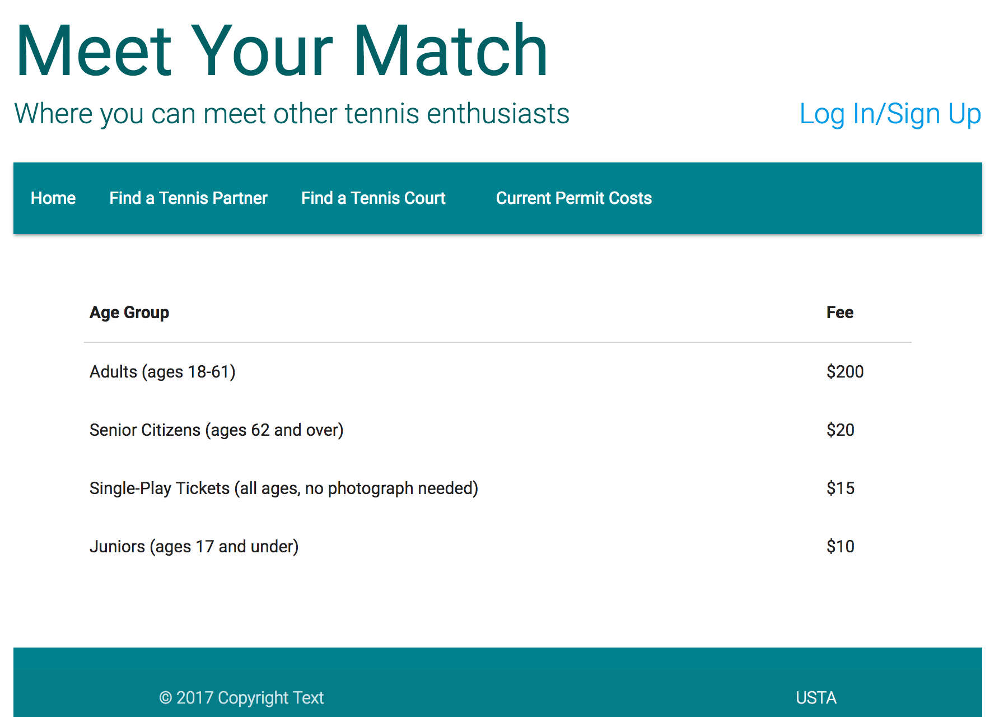
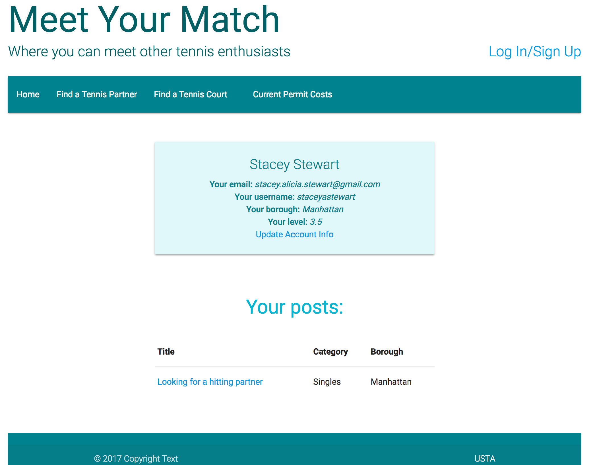

# Meet Your Match
### A forum for tennis players to find partners in NYC


My first full-stack app, which was built in Express.

[If you would like to test out the app please click here and use the following login information:](https://meet-your-match.herokuapp.com/)

```
email: test@test.com
password: password123
```

Allows users that are not logged in to view current NYC court permit costs as well as court locations. Uses the NYC Parks API for this info. Because this info rarely changes, I used fetch to pre-populate the database to avoid making API calls each time the page is loaded.

>


Once users have signed up, they can post in the forum and comment on posts already in the forum. Their user page lists their forum posts, as well as account info.


>


### &hearts;  -  Stacey
